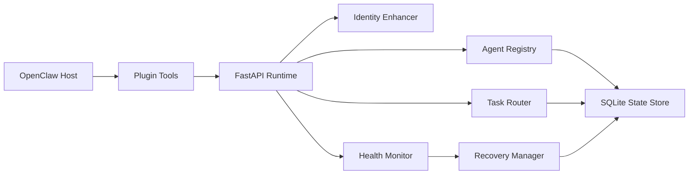

# OpenClaw Smart Agent

[](https://github.com/xinlingzhifei/openclaw-smart-agent/actions/workflows/ci.yml)
[](https://github.com/xinlingzhifei/openclaw-smart-agent/releases)
[](https://github.com/xinlingzhifei/openclaw-smart-agent/blob/main/LICENSE)
[](https://www.python.org/)

OpenClaw Smart Agent is a GitHub-publishable, skill-first bundle for single-machine multi-agent orchestration in OpenClaw. It combines:

- a Python runtime support layer for identity enhancement, registration, routing, heartbeat-backed health snapshots, and task recovery
- an OpenClaw plugin that exposes the runtime as agent tools
- a workspace skill that teaches the host agent when and how to use those tools

See [OpenClaw integration guide](docs/openclaw-integration.md) for the local setup path, verification flow, and plugin installation options.
See [template guide](docs/template-guide.md) for adding or modifying identity templates.

## What v1 includes

- Zero-configuration identity enhancement from YAML templates
- SQLite-backed agent registry and task persistence
- Smart scoring router using skills, load, and priority weighting
- Heartbeat-backed health snapshots for timeout, CPU or memory pressure, and repeated errors
- Recovery flow that requeues work when an agent becomes unhealthy
- REST API plus CLI for local operation

## What v1 does not include

- Cross-machine distributed scheduling
- Built-in LLM inference
- Full process supervisor or container orchestration

## Architecture



## Repository layout

- `src/openclaw_smart_agent/`: Python runtime package
- `plugin/`: OpenClaw plugin package and TypeScript entrypoint
- `skills/openclaw-smart-agent/`: workspace skill bundle
- `config/config.example.yaml`: sample runtime config
- `scripts/install.sh`: bootstrap script for source installs

## Install from GitHub

### Runtime only

Use this when you want the Python runtime and CLI:

```bash
python -m pip install "git+https://github.com/xinlingzhifei/openclaw-smart-agent.git"
openclaw-smart-agent init-config --output config/config.yaml
openclaw-smart-agent serve --config config/config.yaml
```

### Full bundle from a cloned repository

Use this when you also want the workspace skill and plugin package that live in the repository:

```bash
git clone https://github.com/xinlingzhifei/openclaw-smart-agent.git
cd openclaw-smart-agent
./scripts/install.sh
openclaw-smart-agent serve --config config/config.yaml
```

The install script copies the workspace skill into `${OPENCLAW_WORKSPACE:-~/.openclaw/workspace}/skills/openclaw-smart-agent`.

For the full skill-to-plugin-to-runtime verification path, including `smart_agent_heartbeat`, see [docs/openclaw-integration.md](docs/openclaw-integration.md).
You can also run `python scripts/verify_runtime.py` after starting the runtime to exercise the minimal API flow.

## OpenClaw integration

1. Start the runtime service:

```bash
openclaw-smart-agent serve --config config/config.yaml
```

2. Publish the plugin package from `plugin/` to npm or ClawHub.

3. Install that published plugin in OpenClaw.

4. Restart OpenClaw so it picks up the workspace skill from `skills/openclaw-smart-agent/`.

The plugin talks to the runtime through `http://127.0.0.1:8787` by default. Override it with `OPENCLAW_SMART_AGENT_BASE_URL`.

## API quick start

- `POST /api/v1/agents/create`
- `POST /api/v1/agents/heartbeat`
- `GET /api/v1/agents/status`
- `POST /api/v1/tasks/publish`

Example:

```bash
curl -X POST http://127.0.0.1:8787/api/v1/agents/create \
  -H "content-type: application/json" \
  -d '{"identity":"Python开发"}'
```

## Development

```bash
python -m pip install -e ".[dev]"
python -m pytest tests -q
npm --prefix plugin install --no-audit --no-fund
npm --prefix plugin run check
```

## Compatibility notes

- Verified in this repository against Python 3.14 and Node 24.
- The current OpenClaw plugin entry follows the official `openclaw.plugin.json` plus `openclaw.extensions` package metadata model.
- The PRD mentioned `skill.json`, but current OpenClaw documentation uses `SKILL.md` for workspace skills and `openclaw.plugin.json` for plugins, so this repository follows the current upstream format.
